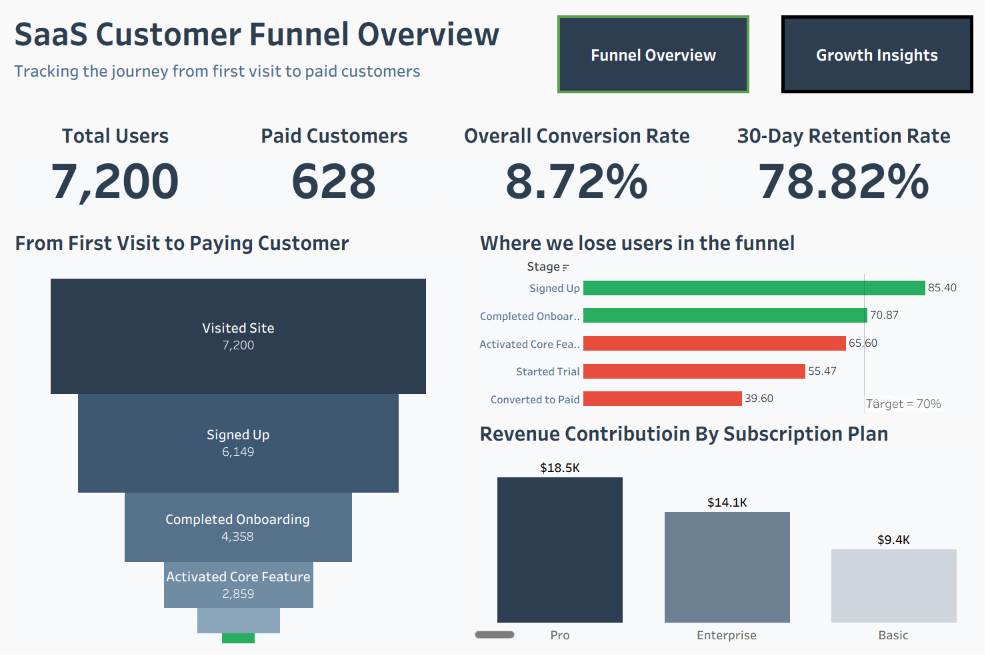
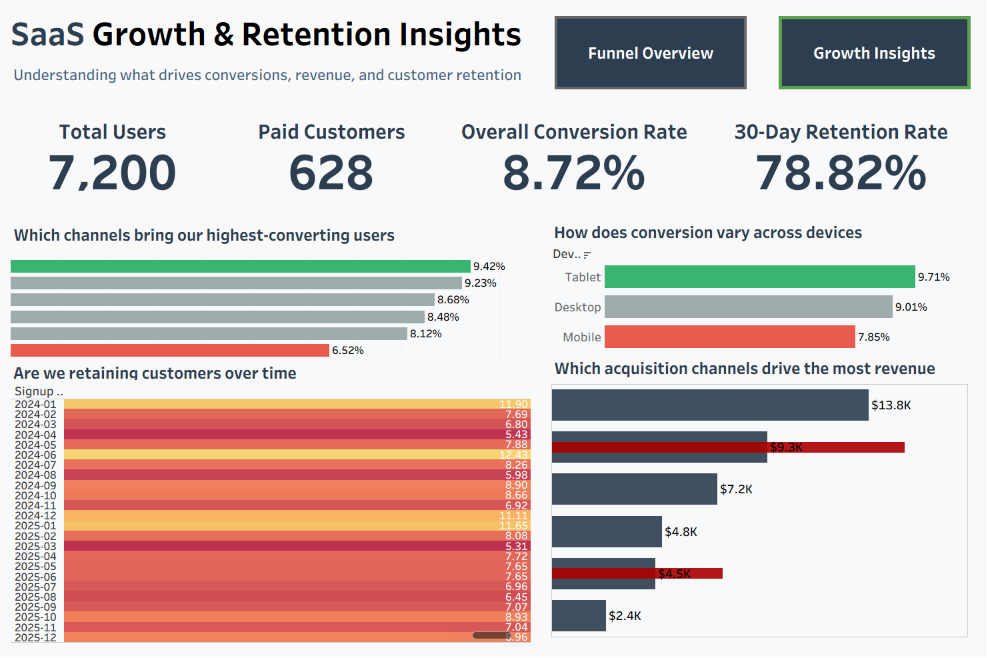

## Project Overview

This project analyzes a SaaS customer funnel to understand user conversion, revenue performance, and customer retention.

The analysis tracks user progression from website visit to paid subscription, identifies conversion bottlenecks, evaluates acquisition channel performance, and uncovers opportunities for business growth.

## Business Questions

- How effectively does the funnel convert visitors into customers?
- Where do the biggest user drop-offs occur?
- Which acquisition channels drive the highest conversions?
- How does conversion vary across devices?
- Which subscription plans generate the most revenue?
- Are customers being retained over time?

## Tools Used

- SQL
- Python
- Excel
- Tableau

## Dashboard Overview

### Funnel Overview

### Growth & Retention Insights

## Key Insights

- Funnel converted 628 paying customers from 7,200 users (8.72% conversion rate).
- Largest drop-offs occurred during product activation and trial-to-paid conversion stages.
- Tablet and Desktop users showed higher conversion rates than Mobile users.
- Pro Plan is the largest revenue driver, contributing more revenue than both Enterprise and Basic plans.
- Organic Search achieved the highest conversion rate among acquisition channels.
- Customer retention remained relatively stable across monthly cohorts.

## Recommendations

- Improve product activation after onboarding.
- Optimize the trial-to-paid conversion experience.
- Focus marketing spend on high-converting acquisition channels.
- Improve mobile user experience.
- Promote premium subscription plans through targeted upselling.
